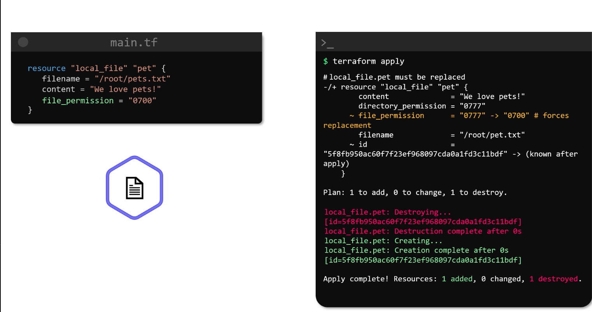
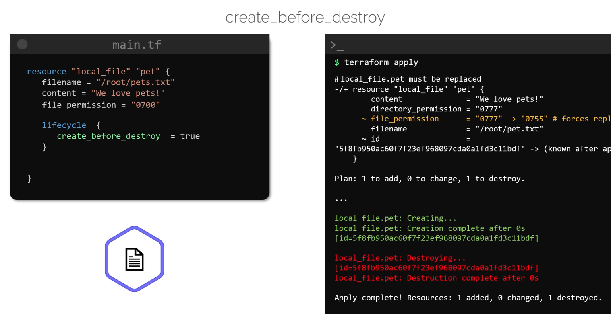
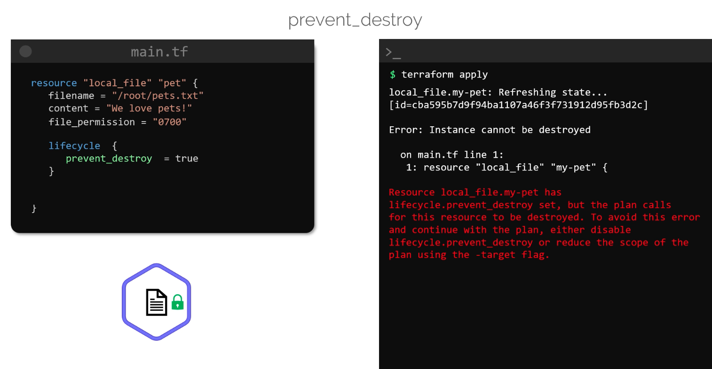
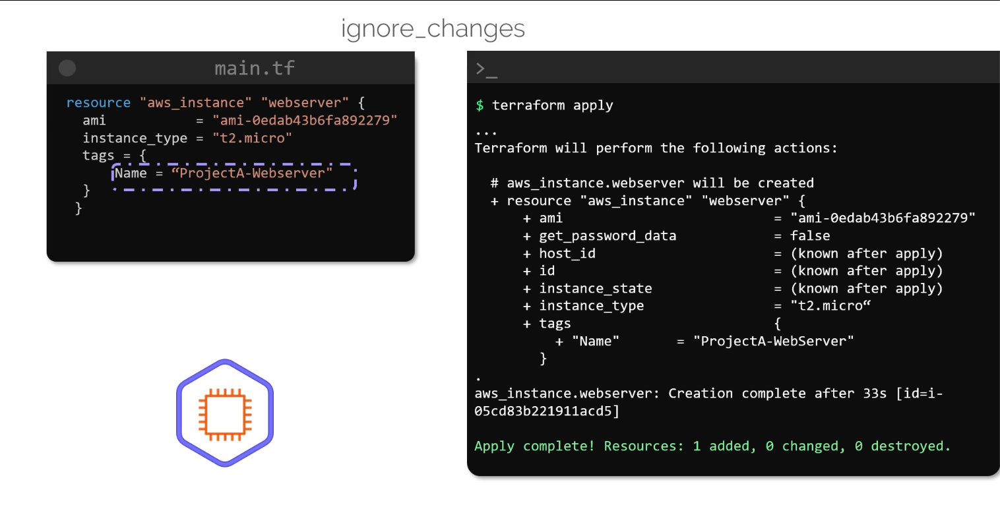
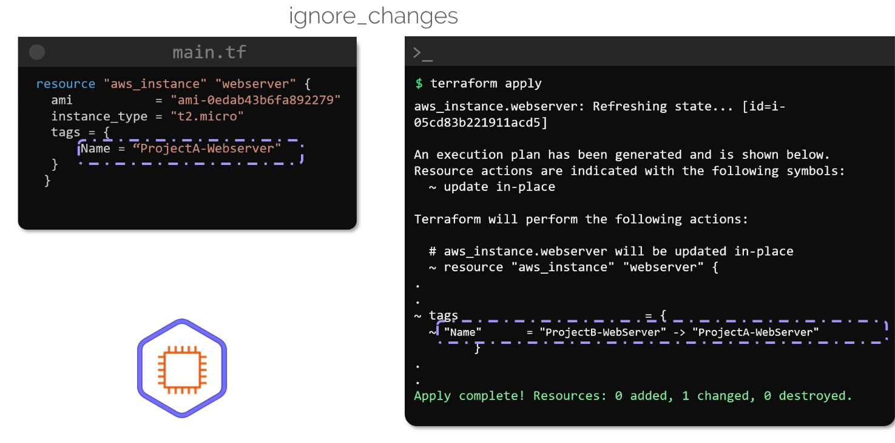
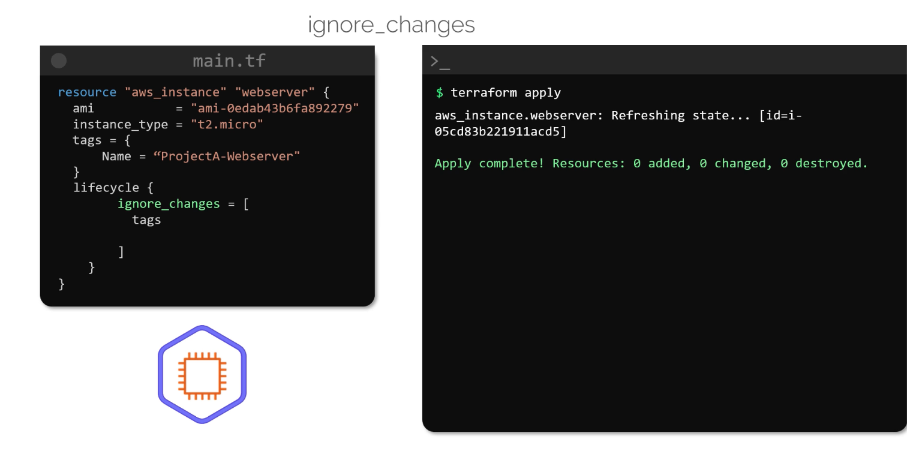
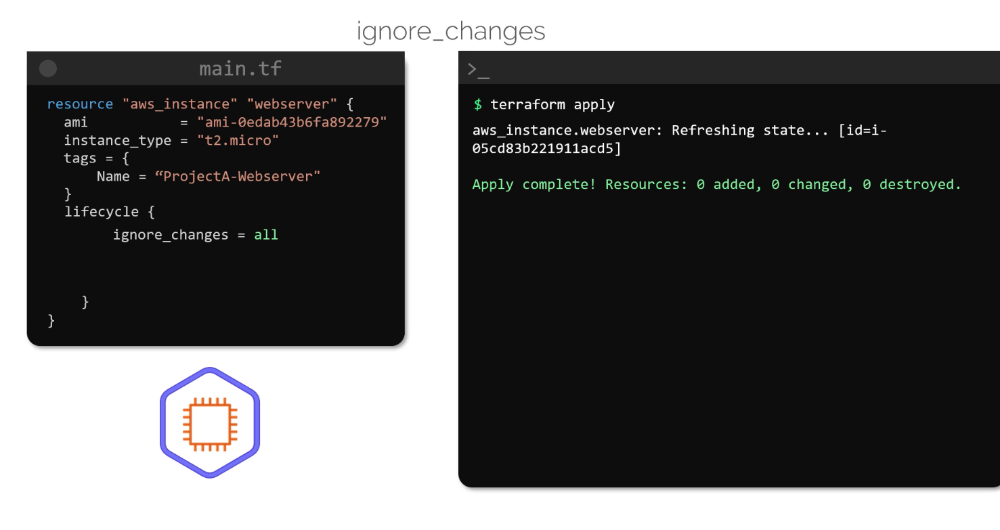

# LifeCycle Rules

> In this article, we explore how to configure lifecycle rules in Terraform to control the order of resource creation and deletion. 
>* Managing resource lifecycles can help ensure service continuity and prevent unintended disruptions during your infrastructure updates.

### Understanding Terraform's Update Mechanism
By default, Terraform’s update process deletes the existing resource before creating a new one, which may not be desirable in all scenarios.




## Life Cycle Rules
Terraform offers several lifecycle rules to modify this default behavior. 
-   These rules can be configured within the resource block to either create the new resource before destroying the old one, prevent resource deletion, or ignore specific attribute changes.

### 1. Rule: `create_before_destory`
This rule instructs Terraform to create a new resource before deleting the old one.
-   This is particularly useful when maintaining service avaiability is critical.

```bash
resource "local_file" "pet" {
  filename        = "/root/pets.txt"
  content         = "We love pets!"
  file_permission = "0700"

  lifecycle {
    create_before_destroy = true
  }
}
```


#### Note:
-   You will see that using the `create_before_destroy` lifecycle rule with the `local_file` resource will cause Terraform to attempt to create the new file first. 
-   However, if the `filename` argument is the same, Terraform immediately deleted the existing file before the new one could be created during the recreation process.
-   This illustrates why using `create_before_destroy` with `local_file` resources is not always advisable, as the file path must be unique for simultaneous creation.

### 2. Rule: `prevent_destroy`
In some cases, you might want to ensure a resource is never accidentally deleted—even if a configuration change would normally force a replacement
- Terraform allows you to achieve this using the `prevent_destroy` rule.


```bash
resource "local_file" "pet" {
  filename        = "/root/pets.txt"
  content         = "We love pets!"
  file_permission = "0700"

  lifecycle {
    prevent_destroy = true
  }
}
```

If you run terraform apply and the plan includes destroying the resource, Terraform will generate an error similar to the following:

```bash
$ terraform apply

#Output
local_file.my-pet: Refreshing state...
[id=cba595b7d9f94ba1107a46f731912d95fb3d2c]
Error: Instance cannot be destroyed

on main.tf line 1:
  1: resource "local_file" "my-pet" {

Resource local_file.my-pet has lifecycle.prevent_destroy set, but the plan calls for this resource to be destroyed. To avoid this error and continue with the plan, either disable lifecycle.prevent_destroy or reduce the scope of the plan using the -target flag.
```



### Note:
Even with `prevent_destroy` enabled, running `terraform destroy` explicitly will still remove the resource. 
>This rule only prevents destruction triggered by configuration changes.

### 3. Rule: `ignore_changes`
This rule is beneficial when you want Terraform to disregard modifications made to specific attributes.
-   For example, if an external process updates the tags on an AWS EC2 Instance, Terraform can be configured to ignore these changes during subsequent runs.

Consider the follwing AWS EC2 Instance Configuration:
```bash
resource "aws_instance" "webserver" {
  ami           = "ami-0edab43b6fa892279"
  instance_type = "t2.micro"
  tags = {
    Name = "ProjectA-Webserver"
  }
}
```




By default, if the tags are updated externally [on AWS] (e.g., changing the tag from “ProjectA-Webserver” to “ProjectB-Webserver”), Terraform will detect the drift and attempt to revert the change:


```bash
$ terraform apply

#Output:
aws_instance.webserver: Refreshing state... [id=i-05cd83b221911acd5]

An execution plan has been generated and is shown below.
Resource actions are indicated with the following symbols:
  ~ update in-place

Terraform will perform the following actions:

  # aws_instance.webserver will be updated in-place
  ~ resource "aws_instance" "webserver" {
      ...
      tags = {
          ~ "Name" = "ProjectB-WebServer" -> "ProjectA-WebServer"
      }
      ...
  }

Apply complete! Resources: 0 added, 1 changed, 0 destroyed.
```



To prevent Terraform from reverting such external changes, add the ignore_changes rule to the lifecycle block:

```bash
resource "aws_instance" "webserver" {
  ami           = "ami-0edab43b6fa892279"
  instance_type = "t2.micro"
  tags = {
    Name = "ProjectA-Webserver"
  }
  lifecycle {
    ignore_changes = [
      tags
    ]
  }
}
```




Alternatively, to ignore changes across all attributes, you can use the special keyword all:

```bash
resource "aws_instance" "webserver" {
  ami           = "ami-0edab43b6fa892279"
  instance_type = "t2.micro"
  tags = {
    Name = "ProjectA-Webserver"
  }
  lifecycle {
    ignore_changes = all
  }
}
```

After applying these settings, Terraform will refresh the state without making any changes:

```bash
$ terraform apply
aws_instance.webserver: Refreshing state... [id=i-05cd83b221911acd5]
Apply complete! Resources: 0 added, 0 changed, 0 destroyed.
```



## Lifecycle Rules at a Glance

| Lifecycle Rule          | Description                                                | Use Case                                                          |
| ----------------------- | ---------------------------------------------------------- | ----------------------------------------------------------------- |
| create\_before\_destroy | Creates the new resource before deleting the old one       | Ensures continuous availability during updates                    |
| prevent\_destroy        | Prevents resource destruction during configuration changes | Protects critical resources from accidental deletion              |
| ignore\_changes         | Ignores changes to specified attributes or all attributes  | Allows external modifications without triggering unwanted changes |

## Summary

In this article, we reviewed three key lifecycle rules in Terraform:

* The **create\_before\_destroy** rule ensures uninterrupted resource availability by creating the new resource first.
* The **prevent\_destroy** rule safeguards critical resources from unintentional deletion.
* The **ignore\_changes** rule allows you to specify attributes that Terraform should ignore during state comparisons, accommodating external changes.
