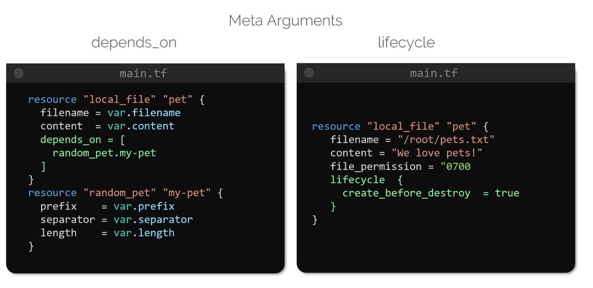

# Meta Arguments
> **Meta-arguments** in Terraform allow you to modify the behavior of resource blocks, enabling advanced configurations such as creating multiple instances of a resource and managing dependencies.


## Tradional Loop Approach

```bash
#!/bin/bash

for i in {1..3}
do  
    touch /root/pet${i}
done
```

After running the above script, listing the directory contents may produce:
```bash
$ ls -lts /root/

$Output:
-rw-r--r-- 1 root root 0 Sep  9 02:04 pet2
-rw-r--r-- 1 root root 0 Sep  9 02:04 pet1
-rw-r--r-- 1 root root 0 Sep  9 02:04 pet3
```

>While Terraform does not directly support loop constructs within a resource block like traditional shell scripts, its meta-arguments provide mechanisms to achieve equivalent outcomes.


## Utilizing Meta-Arguments
Terraform’s meta-arguments can be applied to any resource block to modify its behavior. Two important meta-arguments include:
1. `depends_on`: Defines explicit dependencies between resources to control the order of resource creation.

2. `lifecycle`: Provides rules that control how resources are created, updated and destroyed.



### Example: Enforcing Dependencies

In the following configuration, the `depends_on` meta-argument is used to ensure that the local file resource is created only after the random pet resource:

```hcl  theme={null}
resource "local_file" "pet" {
  filename   = var.filename
  content    = var.content
  depends_on = [
    random_pet.my_pet
  ]
}

resource "random_pet" "my_pet" {
  prefix    = var.prefix
  separator = var.separator
  length    = var.length
}
```

### Example: Using Lifecycle Rules

The `lifecycle` meta-argument can be used to manage resource replacement. For instance, you can ensure that a new resource is created before the old one is destroyed by setting `create_before_destroy` to true:

```hcl  theme={null}
resource "local_file" "pet" {
  filename        = "/root/pets.txt"
  content         = "We love pets!"
  file_permission = "0700"
  
  lifecycle {
    create_before_destroy = true
  }
}
```