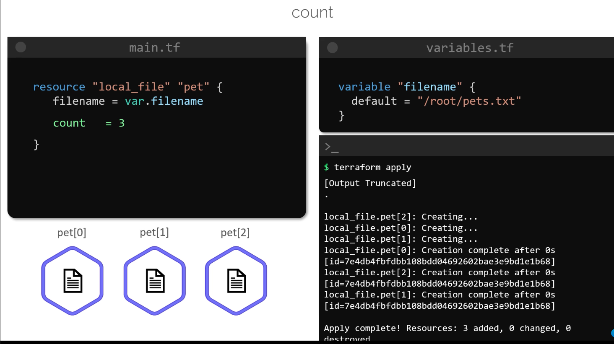
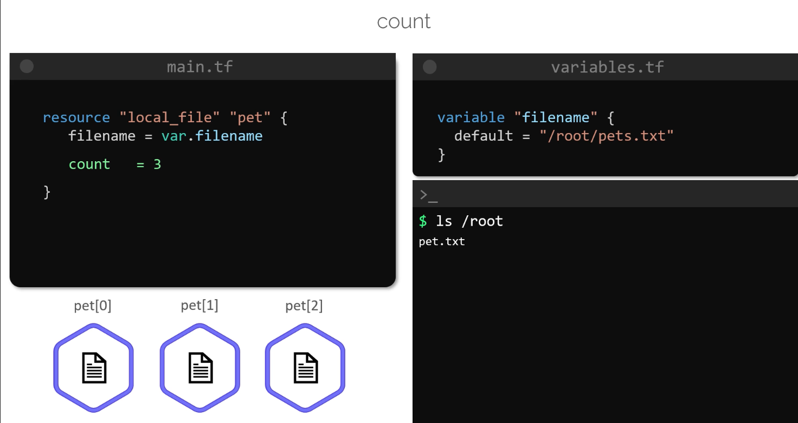
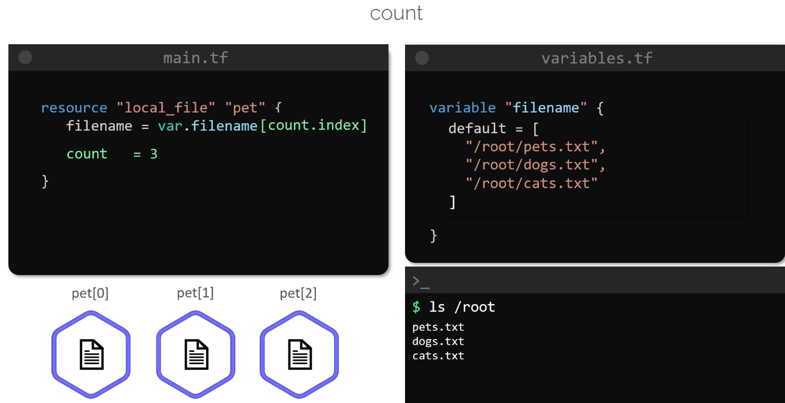
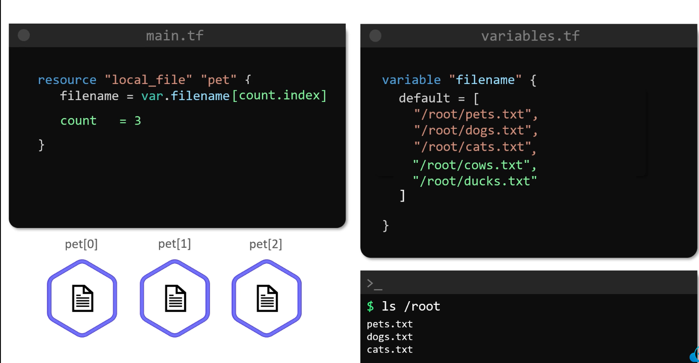

# Count
>This article explores Terraform's **count meta-argument**, demostrating how it can be used to create multiple resource instance and discussing potential issues when modifying the underlying list used with count.

## Creating Multiple Instance with a Static Count

```bash
resource "local_file" "pet" {
  filename = var.filename
  count    = 3
}

variable "filename" {
  default = "/root/pets.txt"
}
```

```bash
$ terraform plan
[Output Truncated]
Terraform will perform the following actions:
...
# local_file.pet[2] will be created
+ resource "local_file" "pet" {
    + directory_permission = "0777"
    + file_permission      = "0777"
    + filename             = "/root/pets.txt"
    + id                   = (known after apply)
}
Plan: 3 to add, 0 to change, 0 to destroy.
```


Each resource is indexed as `pet[0]`, `pet[1]`, and `pet[2]`. Although three resources are created, all instances share the same file name, which means Terraform creates the same file three times rather than three unique files.



### **

## Creating Unique Resource by Using a List Variable
To generate unique resources, update the variable definition to a list and reference each element using count.index. Here is the modified configuration:
```bash
resource "local_file" "pet" {
  filename = var.filename[count.index]
  count    = 3
}

variable "filename" {
  default = [
    "/root/pets.txt",
    "/root/dogs.txt",
    "/root/cats.txt"
  ]
}
```

In this configuration:

* The first iteration (index 0) creates `/root/pets.txt`.
* The second iteration (index 1) creates `/root/dogs.txt`.
* The third iteration (index 2) creates `/root/cats.txt`.


After executing `terraform apply`, listing the `/root` directory produces:

```bash
$ ls /root
pets.txt
dogs.txt
cats.txt
```



## Dynamically Adjusting the Count with the length() Function

A drawback of the previous approach is its fixed count. 
-   If you wish to add more file names, the configuration would still create only three resources. 
-   To adapt dynamically to the number of elements, use the built-in `length()` function:




## A Pitfall: List Element Removal and Resource Replacement

When using count with a list, removing an element causes a shift in resource indices. Consider this configuration:

```hcl  theme={null}
resource "local_file" "pet" {
  filename = var.filename[count.index]
  count    = length(var.filename)
}
```

Initially, the variable is defined with three elements:

```hcl  theme={null}
variable "filename" {
  default = [
    "/root/pets.txt",
    "/root/dogs.txt",
    "/root/cats.txt"
  ]
}
```


After a successful apply, Terraform recognizes three resources: `pet[0]`, `pet[1]`, and `pet[2]`. 

Now, if you remove the first element (`/root/pets.txt`), the updated variable becomes:

```hcl  theme={null}
variable "filename" {
  default = [
    "/root/dogs.txt",
    "/root/cats.txt"
  ]
}
```

Running `terraform plan` now shows:

* The resource at index 0 is updated from `/root/pets.txt` to `/root/dogs.txt`.
* The resource at index 1 is updated from `/root/dogs.txt` to `/root/cats.txt`.
* The resource at index 2 is marked for destruction as there is no corresponding list element.

An abbreviated plan output looks like this:

```bash  theme={null}
$ terraform plan
...
# local_file.pet[0] must be replaced
-/+ resource "local_file" "pet" {
    directory_permission = "0777"
    file_permission      = "0777"
    ~ filename           = "/root/pets.txt" -> "/root/dogs.txt" #
}
# local_file.pet[1] must be replaced
-/+ resource "local_file" "pet" {
    directory_permission = "0777"
    file_permission      = "0777"
    ~ filename           = "/root/dogs.txt" -> "/root/cats.txt" #
}
# local_file.pet[2] will be destroyed
-/+ resource "local_file" "pet" {
    directory_permission = "0777" -> null
    file_permission      = "0777" -> null
    ~ filename           = "/root/cats.txt" -> null #
}
```

>This behavior occurs because the resource indices are directly linked to the order of the list elements. Removing an element causes subsequent elements to shift, resulting in the unnecessary replacement or destruction of resources.


