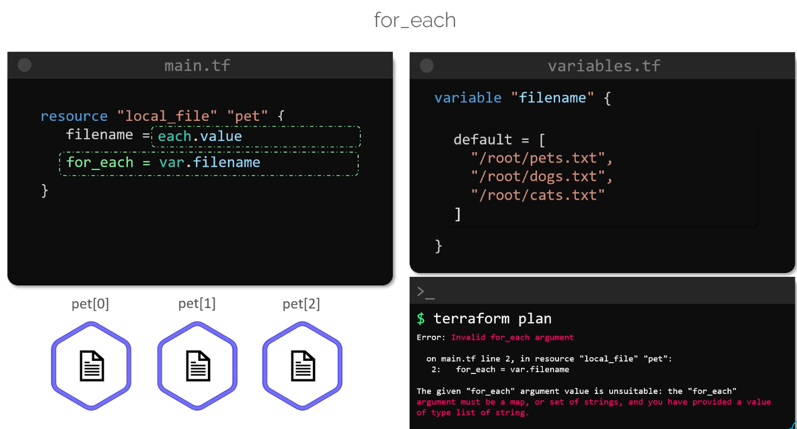
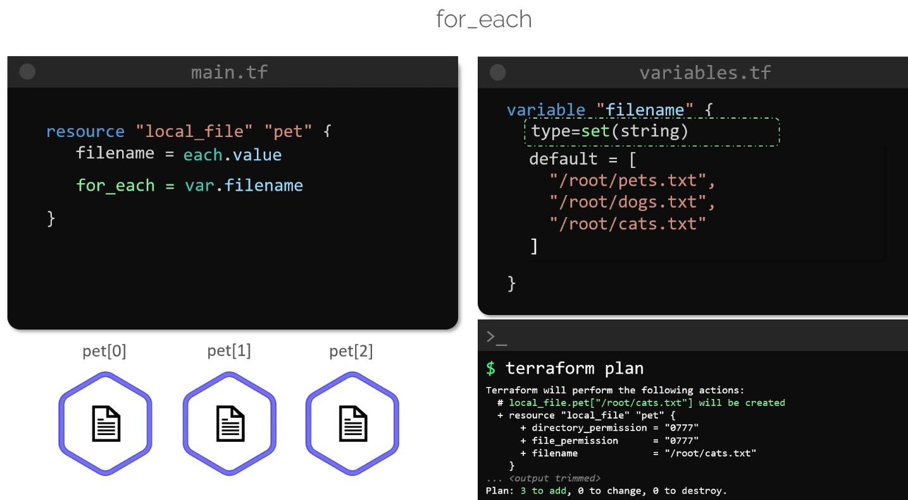
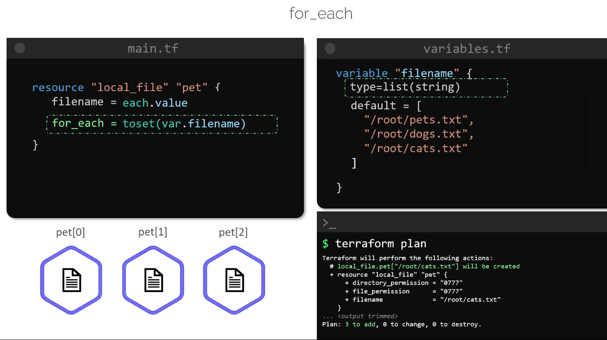
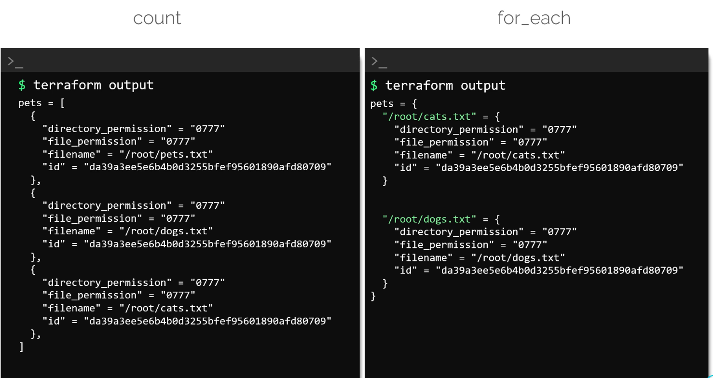

# For_each

In this lesson, we explore the powerful for_each meta-argument in Terraform. 
>By using `for_each`, you can overcome some limitations of the `count` meta-argument and manage resources more reliably.

## Using count with a List
Traditonally, resouces are created using the count meta-argument. 

```bash
resource "local_file" "pet" {
  filename = var.filename[count.index]
  count    = length(var.filename)
}
```

```bash
variable "filename" {
  default = [
    "/root/pets.txt",
    "/root/dogs.txt",
    "/root/cats.txt"
  ]
}
```

## Transitioning to for_each
Swithching to `for_each` can help manage resource more effictively by assigning a unique key to each resource using each value.

```bash
resource "local_file" "pet" {
  filename = var.filename[count.index]
  for_each = var.filename
}

variable "filename" {
  default = [
    "/root/pets.txt",
    "/root/dogs.txt",
    "/root/cats.txt"
  ]
}
```

Running terraform plan with this configuration results in an error. 
-   The `for_each argument` only supports a **map** or a **set** of strings – not a **list** of strings. The error message appears similar to:

    ```bash
    $ terraform plan
    Error: Invalid for_each argument

        on main.tf line 2, in resource "local_file" "pet":
        2:   for_each = var.filename

    The given "for_each" argument value is unsuitable: the "for_each" argument must be a map, or set of strings, and you have provided a value of type list of string.
    ```

    

>Ensure that the data type passed to `for_each` complies with Terraform’s requirements—a `map` or a `set` of strings.


## Correcting the Configuration
There are two approaches to resolve this issue:
1. Change the variable type from a list to a set (sets don't allow duplicate elements)
    


### ***

2.  Convert the list into a set in the resource block using terraform's built-in `toset` function.


    Below is an updated configuration that uses the `toset` funtion:

    ```bash
    resource "local_file" "pet" {
        filename    =   each.value
        for_each    =   toset(var.filename)
    }


    variable "filename" {
        type    =   list(string)
        default =   [
            "/root/pets.txt",
            "/root/dogs.txt",
            "/root/cats.txt"
        ]
    }
    ```

    


## Updating Resources by Removing an Element

Let's simulate updating the configuration by removing an element. For example, removing `/root/pets.txt` from the list changes the configuration to:

```hcl  theme={null}
resource "local_file" "pet" {
  filename = each.value
  for_each = toset(var.filename)
}
```

```hcl  theme={null}
variable "filename" {
  type    = list(string)
  default = [
    "/root/dogs.txt",
    "/root/cats.txt"
  ]
}
```

Running `terraform plan` with this updated variable shows that only the resource associated with `/root/pets.txt` will be destroyed:

```bash  theme={null}
$ terraform plan
Terraform will perform the following actions:
  # local_file.pet["/root/pets.txt"] will be destroyed
  + resource "local_file" "pet" {
      + directory_permission = "0777"
      + file_permission      = "0777"
      + filename             = "/root/pets.txt"
    }

... <output trimmed> ...
Plan: 0 to add, 0 to change, 1 to destroy.
```

The remaining resources persist without change.


### Note

> `count` create a **list**, while `for_each` creates a **map**

