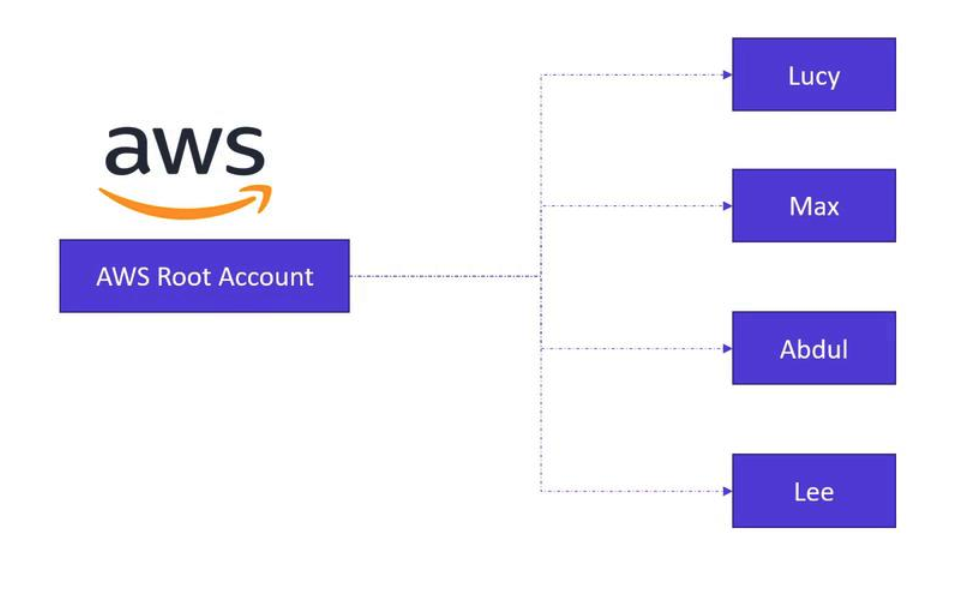

# Introduction to IAM


>In this lesson, we explore Identity and Access Management (IAM) in AWS—a critical component for securing and managing access to cloud resources.

When you first register for an AWS account, you use an email address and password. This email address is linked to the root account, which has complete administrative privileges—similar to the root user in Linux or an administrator in Windows. 
-   Although the root account provides full access to all AWS services, it is highly recommended that you use it only for creating new IAM users. 
-   Once these users are established, secure your root account credentials and refrain from using them for routine tasks.



In this lesson, we demonstrate how to create new IAM users: Lucy, Max, Abdul, and Lee. AWS provides two distinct access methods for these users:

1. **Management Console Access:** Involves a valid username and password for the AWS Management Console.
2. **Programmatic Access:** Enables interactions using CLI tools on platforms like Linux, macOS, or Windows PowerShell, through an access key ID and secret access key.


For instance, to interact with an S3 bucket programmatically, you mkght execute:

```bash
aws s3api craete-bucket --bucket mu-bucket --region us-eas-1
```

>Remember that programmatic access keys do not allow login to the Management Console. This distinction is crucial for maintaining secure access practices.

## Assigning Permissions
>When an IAM user is created, the principle of least privilege is applied.
>* Each user’s capabilities are constrained by the permissions specified in their IAM policy.


For example, if Lucy, the project’s technical lead, needs full administrative access, you would attach AWS’s managed “Administrator Access” policy to her account. The JSON for this policy looks like:

```bash
{
    "Version": "2012-10-17",
    "Statement": [
        {
            "Effect": "Allow",
            "Action": "*",
            "Resource": "*"
        }
    ]
}
```

## IAM Roles for AWS Services

>AWS services, such as an EC2 instance, do not inherently possess permissions to interact with other AWS resources (for example, accessing an S3 bucket).

>To enable an AWS service to interact with another resource, you create an **IAM role.** 

For example, to permit an **EC2 instance** to access an **S3 bucket**, you would establish a role (e.g., “**S3 Access Role”**) and attach a policy like **“Amazon S3 Full Access.”** Once the role is associated with the EC2 instance, it gains the necessary permissions to perform S3 operations.


>Using **IAM roles** is a secure and recommended practice that not only facilitates service-to-service interactions but also supports 
>* cross-account access, 
>* application-based access, and even 
>* temporary access for users managed outside of AWS (e.g., through an organization’s Active Directory).

## Creating Custom IAM Policies.
In addition to AWS managed policies, you can create custom IAM policies to match specific operational requirements.

For instance, if you want a user to be able to create and delete tags on an EC2 instance, you could define a custom policy as shown below:
```bash
{
    "Version": "2012-10-17",
    "Statement": [
        {
            "Effect": "Allow",
            "Action": [
                "ec2:CreateTags",
                "ec2:DeleteTags"
            ],
            "Resource": "*"
        }
    ]
}
```