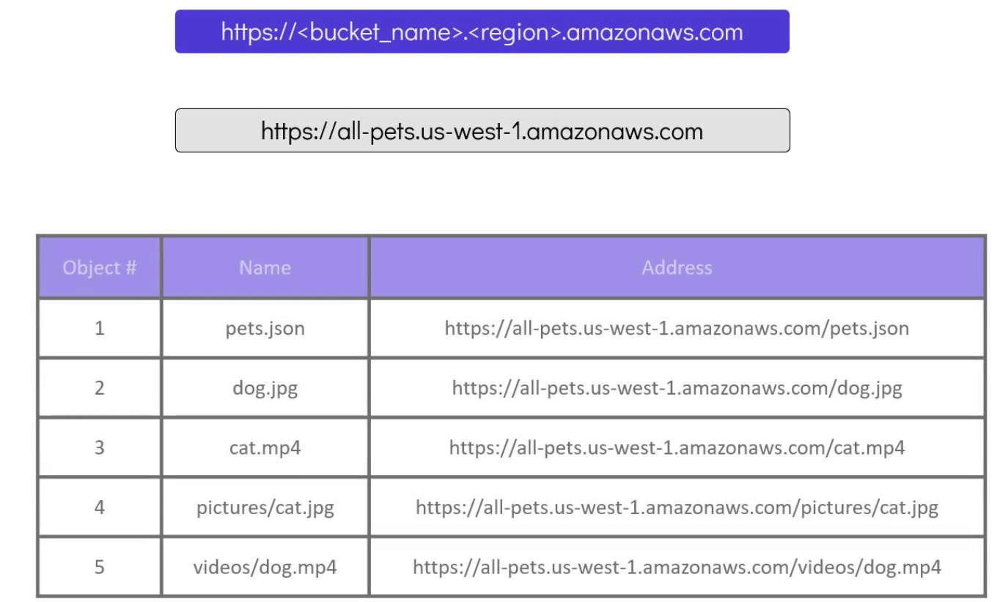
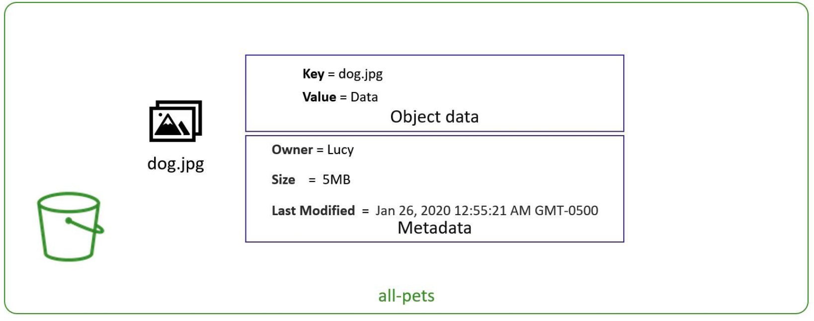
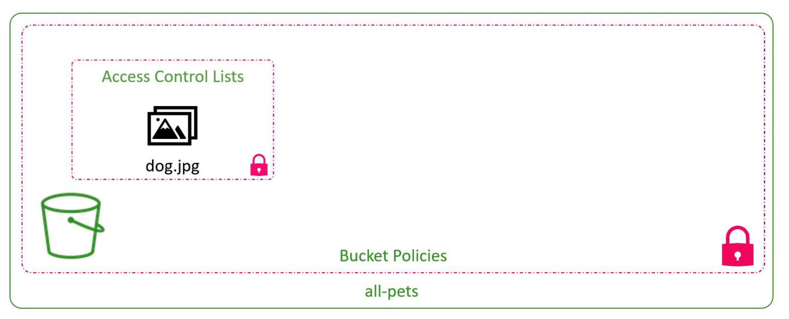

# Introduction to AWS S3

>In this article, we explore AWS S3 -- a highly scalable and reliable storage service designed for the AWS Cloud.
>* AWS S3 (Simple Storage Service) provides an infinitely scalable solution for storing files such as documents, images, and videos.
>* As an object-based storage system, S3 is optimized for storing flat files unlike block storage solutions that are more suitable for operating systems or databases.

## Key Concepts
- Data in S3 is organized into containers called buckets. 
_   Each bucket can hold an unlimited number of objects, and every file stored is treated as a separate object—even when they appear to be organized within folders such as “pictures/cat.jpg” or “videos/dog.mp4”.


## Bucket Fundamentals

When creating an S3 bucket, consider the followign guidelines:

* **Unique Bucket Name:** The bucket name must be unique worldwide, as AWS assigns it a global DNS name.
*   **DNS-Compliant Naming**: Bucket name cannot contain uppercase letters, underscores, or end with a dash. They must be 3 to 63 characters.
*   **File Upload Limit**: Each individual file uploaded to S3 can be a maximum of 5TB in size.

Once created, the bucket is accessible via a unique DNS endpoint. 

-   For example, a bucket named “allpets” in the US West (N. California) region would be accessible at: https://allpets.us-west-1.amazonaws.com

Objects inside the bucket are accessed using the bucket name along with individual object keys.




## Object Structure in S3

An object in S3 consists of:

* **Data**: The file content.
* **Key**: The unique identifier or name of the file.
* **Metadata**: Additional information such as creation time, owner, and file size.



## Access Control
By default, AWS restricts access to a bucket and its objects so that only the bucket owner has access. AWS manages access through:

* **Bucket Policies:** These policies apply permissions at the bucket level.
* **Access Control Lists (ACLs)**: ACLs provide granular control over individual object permissions.



>For enhanced security, consider applying both bucket policies and ACLs to fine-tune access permissions in your AWS S3 environment.


## Bucket Policies in Practice

Bucket policies are JSON documents that control access to your S3 buckets. They can grant or restrict permissions for IAM users, groups, or even external accounts.

Below is an example policy that allows an IAM user named Lucy to retrieve all objects from a bucket called “all-pets”:

```yaml
{
    "Version": "2012-10-17",
    "Statement": [
        {
            "Action": [
                "s3:GetObject"
            ],
            "Effect": "Allow",
            "Resource": "arn:aws:s3:::all-pets/*",
            "Principal": {
                "AWS": [
                    "arn:aws:iam::123456123457:user/Lucy"
                ]
            }
        }
    ]
}
```