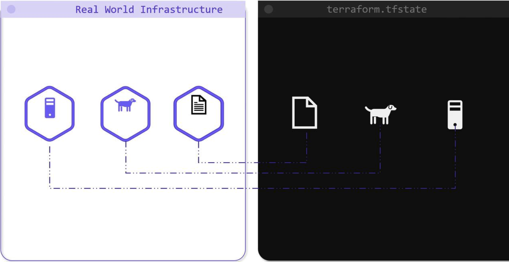
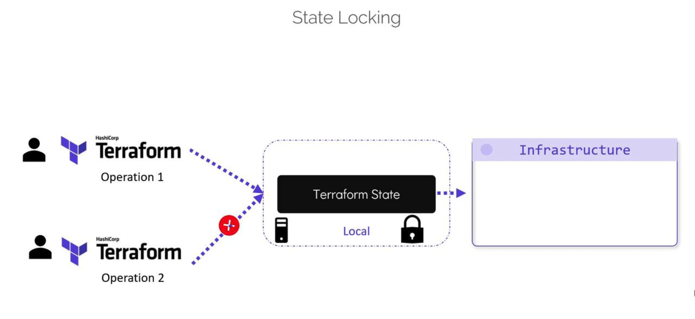
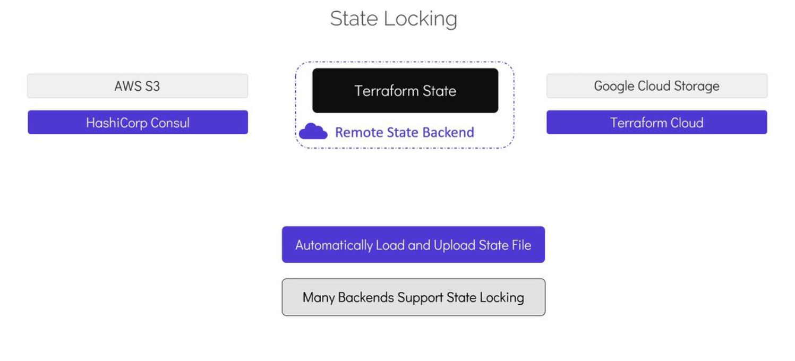

# What is Remote State and State Locking

>In this lesson, we introduce the concept of remote state in Terraform and explain why state locking is essential for effective team collaboration.

Terraform uses a state file to map your configuration resources to your real-world infrastructure. 
-   Intially, this state file was stored locally.
_   When you first run `terraform apply`, a filed name `terraform.tfstate` is created in your configuration directory.



## Benefits of the Terraform State
Storing state locally provides several benefits:

-   Mapping Terraform configurations to real infrastructure.
-   Tracking metadata and resource dependencies, enabling Terraform to create and delete resources in the correct order.
-   Enchancing performance when managing large configurations accross multiple cloud providers.
-   Facilitating team collaboration by offering a single view of the infrastructure state.

For example, your configuration directory might look like:
```bash
$ ls

main.tf variables.tf terraform.tfstate
```

## Challenges with Local State Files
- Sensitive data (e.g, IP addresses, initial database passwords, key name) remains on a local machine
- Concurrent modifications becomes difficult to manage, leading to potential state corruption.
-   Storing the state file in version control is not recommended because it may explore sensative information.

Consider this Terraform configuration that creates files and a pet resource:
```bash
resource "local_file" "pet" {
  filename = "/root/pet.txt"
  content  = "My favorite pet is Mr.Whiskers!"
}

resource "random_pet" "my-pet" {
  length = 1
}

resource "local_file" "cat" {
  filename = "/root/cat.txt"
  content  = "I like cats too!"
}
```

And here is an excerpt from the corresponding state file in JSON format:
```bash
{
  "mode": "managed",
  "type": "aws_instance",
  "name": "dev-ec2",
  "provider": "provider[\"registry.terraform.io/hashicorp/aws\"]",
  "instances": [
    {
      "schema_version": 1,
      "attributes": {
        "ami": "ami-0a634ae95e11c6f91",
        ...
        "primary_network_interface_id": "eni-0ccd57b1597e633e0",
        "private_dns": "ip-172-31-7-21.us-west-2.compute.internal",
        "private_ip": "172.31.7.21",
        "public_dns": "ec2-54-71-34-19.us-west-2.compute.amazonaws.com",
        "public_ip": "34.71.34.19",
        "root_block_device": [
          {
            "delete_on_termination": true,
            "device_name": "/dev/sda1",
            "encrypted": false,
            "iops": 100,
            "kms_key_id": "",
            "volume_id": "vol-070720a363679c22",
            "volume_type": "gp2"
          }
        ]
      }
    }
  ]
}
```

## How Terraform State Locking Works
Terraform incorporates a mechanism called state locking to prevent simultaneous modifications. 

When you run commands like `terraform apply`, Terraform locks the state file to avoid interference from another operation.

```bash
$ terraform apply
...
+ server_side_encryption = (known after apply)
+ storage_class          = (known after apply)
+ version_id             = (known after apply)
...
Plan: 2 to add, 0 to change, 0 to destroy.

Do you want to perform these actions?
Terraform will perform the actions described above.
Only 'yes' will be accepted to approve.

Enter a value: yes

aws_s3_bucket_object.finance-2020: Creating...
aws_s3_bucket.finance: Creating...
[10s elapsed]
aws_s3_bucket_object.finance-2020: Still creating...
aws_s3_bucket.finance: Still creating... [10s elapsed]
aws_s3_bucket_object.finance-2020: Still creating... [20s elapsed]
aws_s3_bucket.finance: Still creating...
```


If another operation is attempted during this process in a separate terminal, Terraform will return an error similar to:

```bash
$ terraform apply
Error: Error locking state: Error acquiring the state lock: resource temporarily unavailable
Lock Info:
  ID:        fefe3806-007c-084b-be61-cef4cdc77dee
  Path:      terraform.tfstate
  Operation: OperationTypeApply
  Who:       root@iac-server
  Version:   0.13.3
  Created:   2020-09-22 20:35:27.051330492 +0000 UTC
Info:

Terraform acquires a state lock to protect the state from being written by multiple users at the same time. Please resolve the issue above and try again. For most commands, you can disable locking with the "-lock=false" flag, but this is not recommended.
```

>Avoid disabling state locking with the `“-lock=false”` flag in a team environment, as doing so can lead to concurrent modifications and potential data loss.



## Remote Backends: A Secure Alternative
-   Version control system like GitHub do not support state locking. 
-   If multiple users access and modify a state file stored in version control simultateously, it can result in conflicts and even data loss.
- Additionally, working with outdatad state files (by not pulling the latest changes) can lead to accidental destructive actions, such as unintended resource rollbacks or deletions.


A far better approach is to store the Terraform state in a secured, shared storage solution using remote backends.
-   Remote backends store the state file outside the configuration directory and version control system using the services such a AWS S3, Google Cloud Storage, HashiCorp Consul, or Terraform Cloud.

With Remote Backend, Terraform can automatically:
-   Loads the state from shared storage for every operation
-   Uploads state updates after each `terraform apply`
-   Provides state locking to maintain state integrity
-   Enhances security by offering features like encryption at rest and in transit.

