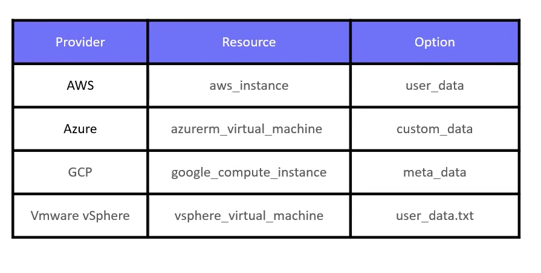

# Considerations with Provisioners

> In this lesson, we explore key considerations when using provisioners in Terraform.
>* Provisioners can be very useful for executing tasks such as bootstrapping wiht a `remote-exec` script; however, their use should be limited.
>* Terraform advises caution when using them due to several reasons.


## Why use Provisioners Sparingly?

Provisioners in Terraform can execute any system-supported command via the command or inline arguments.

This flexibility makes them powerful but also creates challenges:

* They increase the overall complexity of your Terraform configurations.
* Due to dynamic nature of these commands, Terraform cannot accurately predict the outcome during the plan phase.

#### Example: Remote Exec Provisioner
Below is an example Terraform configuration that employs the `remote-exec` provisioner to append the host’s IP address to a file on the remote instance.

```bash
resource "aws_instance" "webserver" {
  ami           = "ami-0edadb43b6fa892279"
  instance_type = "t2.micro"
  tags = {
    Name        = "webserver"
    Description = "An NGINX WebServer on Ubuntu"
  }
  provisioner "remote-exec" {
    inline = ["echo $(hostname -i) >> /tmp/ips.txt"]
  }
}
```

### Connection Block Requirement
For provisioners such as `Remote Exec`, it is essential to define a connection block to establish network connectivity and authenticate to the target instance. 
- The connection details must be configured correctly on the local machine before the provisioner runs, which might not always be feasible.

```bash
resource "aws_instance" "webserver" {
  ami           = "ami-0edab43b6fa892279"
  instance_type = "t2.micro"
  tags = {
    Name        = "webserver"
    Description = "An NGINX WebServer on Ubuntu"
  }
  
  provisioner "remote-exec" {
    inline = ["echo $(hostname -i) >> /tmp/ips.txt"]
  }
}
```

## Best Practices: Use Resource-Native Features
To mitigate the challenges associated with provisioners, Terraform recommends leveraging resource-native features. 

-   For instance, when working with Amazon Elastic Compute Cloud (EC2), you can utilize the **User Data** feature, ensuring that required tasks are executed during instance launch without an explicit connection block.
```bash
resource "aws_instance" "webserver" {
  ami           = "ami-0edadb43b6fa892279"
  instance_type = "t2.micro"
  tags = {
    Name        = "webserver"
    Description = "An NGINX WebServer on Ubuntu"
  }
  user_data = <<-EOF
    #!/bin/bash
    sudo apt update
    sudo apt install nginx -y
    systemctl enable nginx
    systemctl start nginx
  EOF
}
```





## Custom Images and Templating Tools
A best practice is to build custom images that include all the necessary software and configurations from the start. 
-   This approach minimizes the need for post-provisioning tasks during instance initialization.

For example, instead of installing NGINX during launch with User Data or remote-exec, you could use a custom Ubuntu AMI that already has NGINX installed:

```bash
resource "aws_instance" "webserver" {
  ami           = "ami-0edad43b6fa892279"
  instance_type = "t2.micro"
  tags = {
    Name        = "webserver"
    Description = "An NGINX WebServer on Ubuntu"
  }
}
```

>Templating tools come in handy when creating custom AMIs. 
>* You can generate these images by capturing an instance that has the required software and configuration, or by using tools like `Packer`. 
>*`Packer` provides a declarative approach to image building, and once the custom AMI is built, you can refer to it directly in your Terraform configuratio

```bash
resource "aws_instance" "webserver" {
  ami           = "ami-XYZ"
  instance_type = "t2.micro"
  tags = {
    Name        = "webserver"
    Description = "An NGINX WebServer on Ubuntu"
  }
}
```