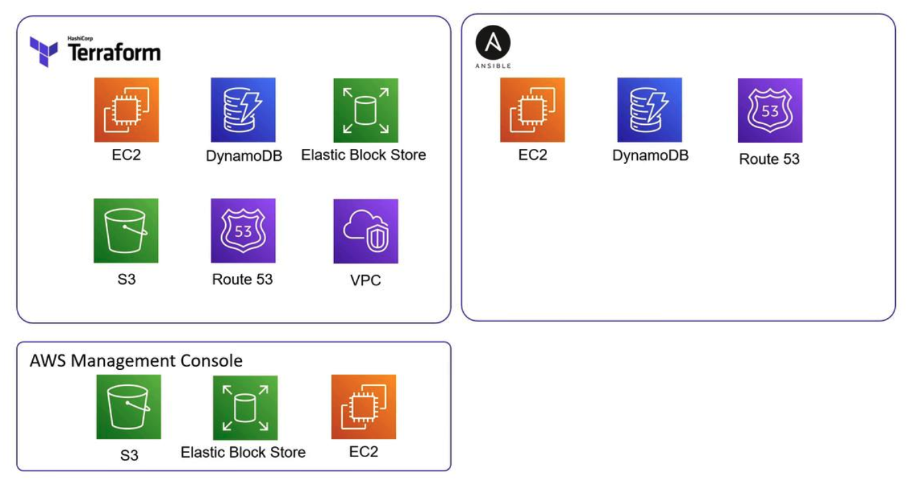

# Terraform Import

> In this guide, we will explain how to import infrastructure into your Terraform configuration using the `terraform import` command.
>* Typically, you create and manage reousrces with Terraform.
>* However, in many real-world projects, some resources might be provisioned with tools like AWS Management Consolve or Ansible.
>>* Importing these resources into Terraform helps streamline provisioning, updates, and deletion.

For instance, consider the following diagram illustrating AWS services managed by Terraform, Ansible, and the AWS Management Console:




## Accessing Existing Resources Using Data Sources
Initially, you might leverage `data sources` in Terraform to fetch details from resources not currently managed by your configuration. 
-   `Data sources `allow you to read attributes and integrate existing infrastructure into your workflow without enabling Terraform to update or delete these resources.

For example, the configuration below reads attributes of an existing AWS instance using its instance ID:
```bash
data "aws_instance" "newserver" {
  instance_id = "i-026e13be10d5326f7"
}

output "newserver" {
  value = data.aws_instance.newserver.public_ip
}
```

When you run:
```bash
$ terraform apply

data.aws_instance.newserver: Refreshing state... [id=i-026e13be10d5326f7]
aws_key_pair.web: Refreshing state... [id=terraform-2020101501348509100000001]
aws_security_group.ssh-access: Refreshing state... [id=sg-0a543f25009e14628]
aws_instance.webserver: Refreshing state... [id=i-068fad300d9df27ac]

Apply complete! Resources: 0 added, 0 changed, 0 destroyed.

Outputs:
newserver = 15.223.1.176
```

Notice that while Terraform outputs the instance’s public IP, it remains unmanaged by Terraform since it’s accessed as a data source.


## Importing an Existing Resource into Terraform
To fully control an existing resource, you need to import it into Terraform’s state. The syntax for the import command is as follows:
```bash
# terraform import <resource_type>.<resource_name> <attribute>
$ terraform import aws_instance.webserver-2 i-026e13be10d5326f7
```

>Before running the import command, ensure that the corresponding configuration exists. If the resource block isn’t defined, Terraform will return an error.


If the resource configuration hasn’t been created, you might see an error like:

```bash
Error: resource address "aws_instance.webserver-2" does not exist in the configuration.

Before importing this resource, please create its configuration in the root module. For example:
resource "aws_instance" "webserver-2" {
  # (resource arguments)
}
```

>`Terraform import` only updates the state file and does not alter configuration files. Hence, ensure that you create an appropriate resource block beforehand.

### Step 1: Create an Empty Resource Block
Begin by defining an empty resource block in your configuration file:
```bash
resource "aws_instance" "webserver-2" {
  # (resource arguments)
}
```


### Step 2: Run the Import Command
After the empty block is defined, run the import command again. It should output something similar to:
```bash
$ terraform import aws_instance.webserver-2 i-026e13be10d5326f7
aws_instance.webserver-2: Importing from ID "i-026e13be10d5326f7"...
aws_instance.webserver-2: Import prepared!
Prepared aws_instance for import
aws_instance.webserver-2: Refreshing state... [id=i-026e13be10d5326f7]

Import successful!
```

The command imports the resource into your Terraform state file, allowing Terraform to manage it moving forward.


### Step 3: Complete the Resource Configuration
Next, update the resource block with the necessary configurations. 
-   **You can retrieve the required attribute values from the AWS Management Console or by inspecting the state file.**


For example, update the resource configuration as follows:
```bash
resource "aws_instance" "webserver-2" {
  ami                    = "ami-0edab43b6fa892279"
  instance_type          = "t2.micro"
  key_name               = "ws"
  vpc_security_group_ids = ["sg-8064fdeee"]
}
```

Running a Terraform plan now ensures that your configuration matches the imported infrastructure:

```bash
$ terraform plan
Refreshing Terraform state in-memory prior to plan...
The refreshed state will be used to calculate this plan, but will not be persisted to local or remote state storage.

aws_instance.webserver-2: Refreshing state... [id=i-0d7c0088069819ff8]
-------------------------------------------------------------------------------
No changes. Infrastructure is up-to-date.
```

>This output confirms that Terraform has successfully imported the resource. Any future changes to the infrastructure can be managed by modifying this configuration and following the standard Terraform workflow: init, plan, and apply.