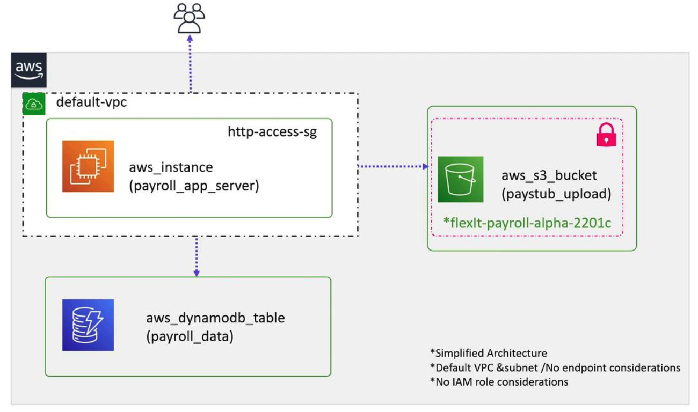

# Creating and using a Module

>In this guide, we will create a reusable terraform module to deploy multiple environments for the same infrastructure.
-   Imagine an organication called FlexIT Consulting that has developed a prototype payroll software.
-   This software needs to be deployed in several countries on AWS Cloud using the same core architecture.


The simplified architecture leverages the default VPC and incorporates the following components:

* An EC2 instance (using a custom AMI) that hosts the application server.
* A DynamoDB NoSQL database to store employee and payroll data.
* An S3 bucket to store documents such as pay stubs and tax forms.
* Users accessing the application on the EC2 instance.


These components integrate to form a basic deployment model for the payroll application.


The goal is to encapsulate this setup into a Terraform module so that the same stack can be deployed across different regions. Based on the high-level design outlined above, let’s create the corresponding Terraform configuration.

>Some values, such as the instance type, are hard-coded for consistency, while others — like the AMI and region-specific naming — are configurable via variables.


## Module Directory Structure
We will create a module under a directory named `modules`. For instance, you might place the module in the following path:

```BASH
/root/terraform-projects/modules/payroll-app
```

Within this directory, you will create configuration files for the necessary AWS resources: an EC2 instance, an S3 bucket, and a DynamoDB table. Execute these commands to set up the module directory and create the required files:

```bash
$ mkdir -p /root/terraform-projects/modules/payroll-app
# Create the following files inside the payroll-app directory:
#   app_server.tf, dynamodb_table.tf, s3_bucket.tf, variables.tf
```

### EC2 Instance Configuration (`app_server.tf`)

```bash
resource "aws_instance" "app_server" {
    ami =   var.ami
    instance_type   =   "t2.medium"
    tags    =   {
        Name    =   "${var.app_region}-app-server"
    }
    depends_on  =   [
        aws_dynomodb_table.payroll_db,
        aws_s3_bucket.payroll_data
    ]
}
```

### S3 Bucket Configuration (`s3_bucket.tf`)

```bash
resource "aws_s3_bucket" "payroll_data" {
    bucket  =   "${var.app_region}-${var.bucket}"
}
```

### DynamoDB Table Configuration (`dynomodb_table.tf`)

```bash
resource "aws_dynamodb_table" "payroll_db" {
    name    =   "user_data"
    billing_mode    =   "PAY_PER_REQUEST"
    hash_key    =   "EmployeeID"

    attribute   {
        name    =   "EmployeeID"
        type    =   "N"
    }
}
```

### Variables Declarations (`variables.tf`)

```bash
variable "app_region" {
    type    =   string
}


variable    "bucket" {
    default =   "flexit-payroll-alpha-22001c"
}

variable "ami" {
    type    = string
}
```

## Deploying the Application Stack
### Deployment in the US EAST 1 Region
To deploy the stack in the US EAST 1 region, create a new directory (for example, `/root/terraform-projects/us-payroll-app`) to server as the root module.

Inside this directory, add the following `main.tf` file:

```bash
$ mkdir -p /root/terraform-projects/us-payroll-app
```


```bash
module "us-payroll" {
    source =    "../modules/payroll-app"
    app_region  =   "us-east-1"
    ami -   "ami-24e140119877avm"
}
```

This configuration specifies that the AWS provider should operate in the US East 1 region using the provided custom AMI. While the module hardcodes values such as the instance type and DynamoDB table parameters for consistency, it still enables regional customizations for the bucket name and AMI.

```bash
$ terraform init
$ terraform plan
$ terraform apply
```

```bash
Terraform will perform the following actions:
# module.us_payroll.aws_dynamodb_table.payroll_db will be created
+ resource "aws_dynamodb_table" "payroll_db" {
    arn          = (known after apply)
    billing_mode = "PAY_PER_REQUEST"
    hash_key     = "EmployeeID"
    name         = "user_data"
  }
# module.us_payroll.aws_instance.app_server will be created
+ resource "aws_instance" "app_server" {
    ami           = "ami-24e140119877avm"
    instance_type = "t2.medium"
  }
# module.us_payroll.aws_s3_bucket.payroll_data will be created
+ resource "aws_s3_bucket" "payroll_data" {
    bucket = "us-east-1-flexit-payroll-alpha-22001c"
  }

Enter a value: yes
module.us_payroll.aws_dynamodb_table.payroll_db: Creating...
```

### Deployment in the UK (London) Region
To deploy the same stack in the UK region, create another directory (for example, `/root/terraform-projects/uk-payroll-app`) for the root module. Since both the app_region and the AMI vary by region, your `main.tf` should include the following configuration:


```bash
$ mkdir -p /root/terraform-projects/uk-payroll-app
```

```bash
module "uk-payroll" {
    source  = "../modules/payroll-app"
    app_region  =   "eu-west-2"
    ami        = "ami-35e140119877avm"

}

provider "aws" {
  region = "eu-west-2"
}
```

When you run `terraform apply`in this directory, Terraform will deploy the identical stack in the London region. Note that the S3 bucket name is automatically prefixed with the region code:

```bash
Terraform will perform the following actions:
# module.uk_payroll.aws_dynamodb_table.payroll_db will be created
+ resource "aws_dynamodb_table" "payroll_db" {
    arn          = (known after apply)
    billing_mode = "PAY_PER_REQUEST"
    hash_key     = "EmployeeID"
    name         = "user_data"
  }
# module.uk_payroll.aws_instance.app_server will be created
+ resource "aws_instance" "app_server" {
    ami           = "ami-35e140119877avm"
    instance_type = "t2.medium"
  }
# module.uk_payroll.aws_s3_bucket.payroll_data will be created
+ resource "aws_s3_bucket" "payroll_data" {
    bucket = "eu-west-2-flexit-payroll-alpha-22001c"
  }

Enter a value: yes
module.uk_payroll.aws_dynamodb_table.payroll_db: Creating...
module.uk_payroll.aws_s3_bucket.payroll_data: Creating...
module.uk_payroll.aws_dynamodb_table.payroll_db: Creation complete after 1s [id=user_data]
```

>Ensure you have the appropriate AWS credentials configured for each target region before running Terraform commands.


## Module Resource Addressing
When using modules, each resource is addressed with the syntax that concatenates the module name, the resource type, and the resource name. For example, the DynamoDB table in the `us_payroll` module is referenced as:


```bash
module.us_payroll.aws_dynamodb_table.payroll_db
```